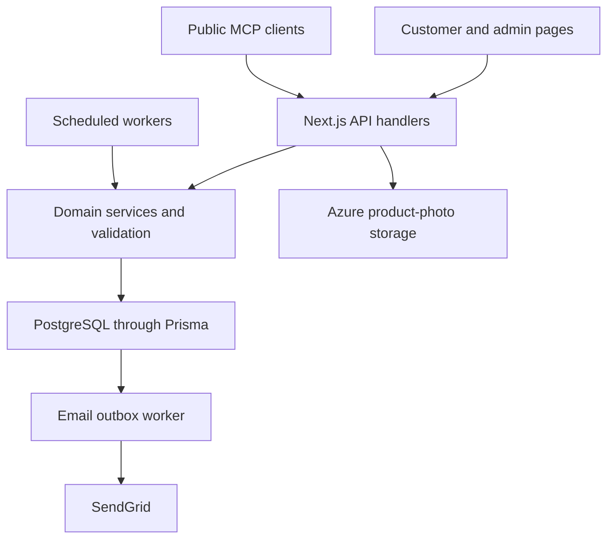

# Architecture and data contracts

## Application layout

FreshPick is a Next.js App Router application with React, TypeScript and Tailwind. The default backend is the same application's `app/api` routes. Prisma connects it to PostgreSQL. Some legacy identifiers and model adapters remain, but the authoritative store is relational PostgreSQL, not MongoDB.

| Directory | Responsibility |
| --- | --- |
| `app/` | Public/account/admin pages, API routes and metadata endpoints |
| `components/` | Storefront controls, shared UI and admin dialogs/tables |
| `contexts/` | Client-side authentication and shopping state |
| `lib/services/` | Auth, catalog adapters, recurring scheduling and mail domain services |
| `lib/` | Checkout, pricing, delivery policy, serialization, content, SEO and MCP helpers |
| `prisma/schema.prisma`, `prisma/migrations/` | Authoritative database schema and versioned changes |
| `netlify/functions/` | Scheduled recurring-order/basket and email workers |
| `public/` | Static assets, branding and install/offline resources |
| `__tests__/`, `scripts/verify-checkout-integrity.*` | Unit/API/smoke and real-database integrity checks |

## Data relationships

| Domain | Records / relationship | Boundary |
| --- | --- | --- |
| Identity | User, addresses, refresh and email tokens; optional supplier association | Primary role and secondary enum roles differ from legacy dynamic Role records |
| Catalog | Product → Category and Supplier; images/attributes/promotions | Archived products excluded from active shopping; historical order lines preserve sale facts |
| Shopping | User-owned bags/items and wishlist | Ownership must be enforced before accepting submitted IDs |
| Orders | Order → customer, item lines, address snapshot, status/payment, optional recurring source | `isRecurring` template is a schedule; generated instances are actual orders |
| Baskets | SubscriptionPlan → contents; User → Subscription → SubscriptionDelivery → optional Order | Manual delivery has no order; stock-managed delivery links one |
| Editorial | Blog records plus tagged collection content | Published/deleted/category predicates define public visibility |
| Vendor onboarding | Supplier application review fields and supplier uploads | Active approved supplier required for upload; import remains explicit |
| Customer communication | Enquiries, business leads, newsletter subscribers, messages and notifications | Distinct workflows; a ticket note does not send a message or email |
| Reliable submission | Checkout/subscription receipts and contact submission ID | Exact request retry is separate from a changed request |
| Operations | Email outbox, audit activities | Outbox is durable; audit coverage is best-effort and incomplete |

Read [schema](../prisma/schema.prisma) for exact field/enumeration definitions. Response serializers add `_id` for compatibility; it aliases Prisma `id`, not a MongoDB ObjectId. Do not mix UUIDs, public slugs, SKU values or order numbers: each API explicitly resolves the identifiers it permits.

## Checkout transactions

`prepareCheckout` reads active products, resolves UUID/SKU/slug identifiers, merges duplicate product quantities and calculates current sale-price lines and a quote fingerprint. `reserveCheckoutStock` conditionally decrements stock only if the product is still active, its price/promotion still matches and enough stock remains.

Creation writes inventory, order, idempotency result and transactional order email together where the caller supplies the transaction. A thrown guard error rolls the entire transaction back. Quote fingerprints detect changed totals; the receipt hash excludes the quote fingerprint so the request's underlying purchase intent has a stable identity.

Ordinary order changes use guarded state/update timestamp writes and inventory deltas. Basket-linked orders additionally use basket lifecycle validation and synchronized delivery versions. Never bypass these helpers with an isolated stock decrement or direct status mutation in a new endpoint.

## Basket transaction boundary

The scheduler locks the subscription and reads the plan under a lock, claims the exact due date, validates the mapped products and address, reserves inventory and creates its linked order/delivery. The next date advances in the same transaction. On failure the schedule remains due and a separate error marker makes it visible for retry.

The delivery snapshot freezes that delivery's plan/content/address/price. Later plan changes affect later creation. Capacity counts active/pending/paused enrollments, and cancellation releases a place once. `totalDeliveries` changes only on completion, not scheduling. See [Subscriptions](SUBSCRIPTIONS.md) for calendar and overdue behavior.

## Authentication and authorization

- Password auth uses bcrypt; access tokens are short-lived and refresh tokens are hashed, stored and rotated. Cookie helpers own browser session handling.
- Firebase Admin verifies Google identity; the client token is not trusted without server validation.
- Modern admin middleware rereads the user and recognizes primary/secondary admin roles while rejecting banned users.
- Legacy route wrappers differ. Some primary-role checks and direct JWT checks remain. Do not infer consistent granular permissions from the page layout alone.
- Owner IDs are derived from verified sessions in protected shopping APIs. Public catalog/MCP reads intentionally need no account.
- Rate-limit helpers use process memory. Their quotas are per warm process, not a deployment-wide guarantee. Origin helpers exist but are not universally invoked as a CSRF policy.
- Legacy referral mutation routes need stronger authorization and verified order events before monetary activation.

## Address and pricing contracts

Stored address fields include `recipientName`, `streetAddress`, `town`, `city`, `state`, `postalCode`, `countryCode` and `phoneNumber`. Checkout address uses `name`, `phone`, `street`, `city`, `state`, `zipCode`, `country`. Map these explicitly; copying one shape blindly into another fails validation.

Delivery policy reads approved environment settings. Missing/invalid required fee disables ordinary checkout instead of inventing a rate. Sri Lankan country values and configured cities are normalized; Colombo numbered areas normalize for matching. Free delivery requires subtotal **greater than** the configured threshold. Customer order discounts other than zero have no verified issuance mechanism and are rejected. Admin creation can record allowed shipping/tax/discount amounts but still derives catalog item prices and guards discount bounds.

All public money serializers convert Prisma Decimal values to numbers for JSON. Helpers round sale totals; basket allocations preserve an exact cent total. Avoid comparing raw floating-point expressions in new pricing code.

## Workers and email reliability

The recurring worker runs both schedulers in parallel on a 15-minute configured schedule. Each service bounds work/time; it is not a perpetual background process. Scheduled execution must be verified on the published host. Local `npm run dev` does not run the Netlify schedule automatically.

Email writes enter a database outbox first. The worker claims leased rows, respects consent generation, calls SendGrid with a bounded timeout and retries failures with backoff, up to six attempts. Terminal rows have retention/cleanup behavior; sent message bodies are cleared. External mail delivery is at least once: if a provider accepts but the subsequent database update fails, a duplicate send can occur. Database dedupe prevents redundant queueing where the caller supplies a dedupe key; it cannot promise exactly-once provider delivery.

Configuration, leases and recovery details belong to [Operations](OPERATIONS.md), which should be followed for production changes.

## Images, content and cache

Production product uploads use Azure durable storage, with content signature/size checks and randomly generated paths. Development disk fallback is not a production persistence strategy. Supplier spreadsheet original storage is a separate legacy mechanism and can be inline in database records.

Public editorial rendering sanitizes Markdown. Slugs, collection content parsing and published visibility helpers prevent raw stored content from becoming an unrestricted script surface. Metadata/JSON-LD serialization escapes unsafe characters.

Public catalog/editorial queries use caching/revalidation where implemented; subscription plan listing can be cached for five minutes. Admin and owner subscription data use private/no-store behavior. Do not cache owner responses under shared keys. Page edits and scheduled events need the relevant existing revalidation paths; direct database changes may remain stale until cache expiry.

## MCP boundary

The stateless Streamable HTTP endpoint creates a server for each request and exposes only `search_products`, `get_product` and `list_categories`. It has body/query limits, host/origin checks and a per-process quota. It cannot read accounts, orders, payments or admin fields, or make purchases. Installation in an external client is a separate step. See [MCP configuration](mcp.md).

## Extending the application

For a new capability, define server validation, owner/admin policy, transaction boundary, historical snapshot rules and operator recovery before wiring the UI. Reuse current pricing/inventory/lifecycle helpers. Add meaningful failure/concurrency checks when touching commerce. Document UI/API differences, particularly when an API has controls not exposed in the form.
