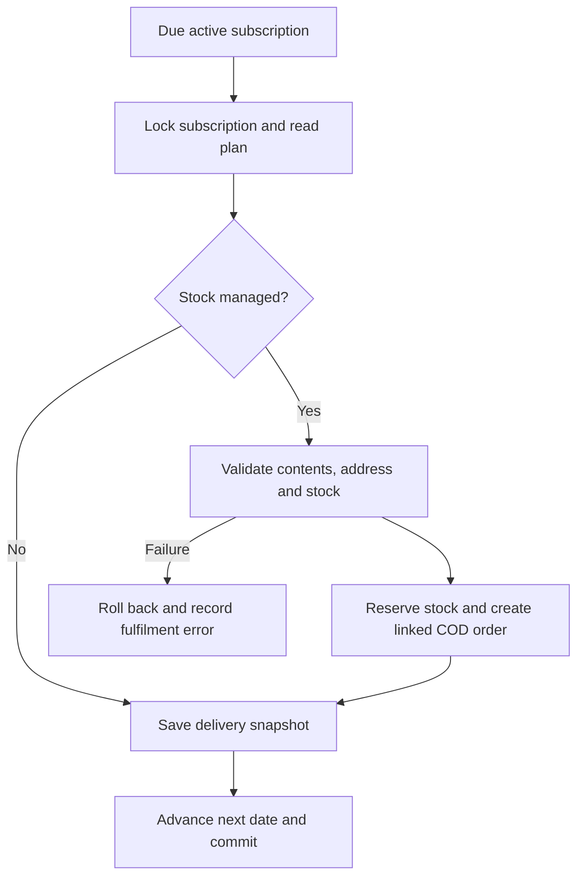

# Subscriptions and recurring orders

FreshPick has two scheduling systems. **Subscription baskets** are fixed-price plans with a delivery queue. **Recurring orders** repeat a customer's grocery order using current catalog prices. They share a scheduled worker but have different records, prices and management screens.

Sources: [basket service](../lib/services/subscriptionDeliveryService.ts), [recurring-order service](../lib/services/recurringOrderService.ts), [subscription actions](../app/api/subscriptions/[id]/route.ts), [scheduled worker](../netlify/functions/process-recurring-orders.ts).

## 1. What is available now

| Capability | Implemented behavior |
| --- | --- |
| Plan discovery | `/subscriptions` shows active database plans, sorted by price; empty plans produce a clear empty state |
| Join a plan | Plan cards link to `/checkout?plan=<slug>`; authenticated customer enters delivery details |
| Cadences | `weekly`, `biweekly` (fortnightly), `monthly` |
| Payment | Customer subscription request accepts `cod`; there is no automatic card debit |
| Owner controls | `/profile/subscriptions`: pause, resume, skip next date, cancel |
| Admin plans | `/admin/subscriptions`: create, edit, activate/deactivate, feature and delete unused plans |
| Fulfilment | `/admin/subscription-deliveries`: prepare, mark delivered, cancel one delivery, retry blocked baskets |
| Automatic scheduling | Published worker every 15 minutes calls both scheduling systems |
| Stock-managed baskets | Reserve mapped product units and create a linked fixed-price cash order atomically |
| Manual baskets | Create a delivery snapshot only; staff manage stock and collection outside that automation |

The word “weekly” in the navigation is a customer-friendly entry point. The system supports all three configured plan frequencies.

## 2. Plan definition

| Field | Meaning and constraints | Admin form |
| --- | --- | --- |
| `name` | 1–150 characters | Yes |
| `shortDescription` | 1–300 characters | Yes |
| `description` | 1–5,000 characters | Yes |
| `price` | Positive LKR amount, at most two decimals, maximum 9,999,999,999.99 | Yes |
| `originalPrice` | Optional positive comparison price | API/schema; not a dedicated form control |
| `frequency` | `weekly`, `biweekly`, `monthly` | Yes |
| `image` | HTTPS URL or local root path; default basket image for omitted value | Yes |
| `isActive` | Available to new subscriptions and due processing | Yes |
| `isFeatured` | Merchandising flag | Yes |
| `inventoryManaged` | Whether basket contents reserve stock and create an order | Yes |
| `contents` | Up to 40 rows: display name, display quantity, category, optional product UUID and whole `units` (1–10,000) | Yes |
| `maxSubscribers` | Optional capacity 1–1,000,000; null means unlimited | API/schema; not a dedicated form control |
| `features`, `icon`, `color` | Optional display metadata | API/schema; not all exposed by the form |

Plan name edits do not regenerate the slug. Updates require `version` equal to the plan's `updatedAt` ISO timestamp; stale edits return 409. Replacing contents is atomic. Mapped products must exist and be non-archived, including mappings on manual plans. Stock-managed plans require nonempty contents with every row mapped. Repeated product mappings are aggregated and cannot exceed 10,000 units for one product.

**Display quantity and reserved units are different.** For example, “500 g” describes the offered package, while `units: 2` reserves two units of that catalog product. The system does not parse “500 g” into stock arithmetic.

## 3. Choose the correct fulfilment mode

| Behavior | Manual mode (`inventoryManaged: false`) | Stock-managed mode (`true`) |
| --- | --- | --- |
| Product mapping | Optional, but supplied mappings must be valid | Required for every content row |
| At customer signup | Save subscription, capacity counter and next date | Same; no stock reservation yet |
| When due | Create a pending delivery snapshot | Reserve stock, create linked `BASKET-…` order and delivery snapshot |
| Price record | Snapshot current plan price on delivery | Plan price allocated across order items; delivery included |
| Payment record | No automatic order/payment record | Order payment method `cash`, payment status `pending` |
| Confirmation email | No linked-order confirmation generated by this path | Queued with linked order when customer email is available |
| Out-of-stock | Staff handle manually | Transaction fails; subscription appears in Needs attention |
| Address/area rules | Staff fulfil manually | Valid checkout address, configured delivery policy and allowed area required |
| Stored special preferences/exclusions | Staff interpretation | Block automatic fulfilment rather than substitute silently |
| Overdue processing | Advances one cycle; subsequent worker passes may create further overdue records | Creates one catch-up basket and advances schedule into the future |

For an automated customer offering, map the real sellable products, confirm stock units and configure delivery policy before activating a stock-managed plan. Neither mode collects money automatically.

## 4. Customer signup and scheduling

The checkout plan flow sends a plan UUID, checkout address, selected weekday, `timeSlot: "Any time"`, COD and optional start date. It does not send arbitrary RRULEs or an end date for a basket plan. The server enforces the plan's frequency.

Example request; replace placeholder IDs and contact details with test fixtures:

```http
POST /api/subscriptions
Content-Type: application/json
Idempotency-Key: basket_test_20261003_001
```

```json
{
  "planId": "PLAN_UUID",
  "deliveryAddress": {
    "name": "Test Customer",
    "phone": "+94770000000",
    "street": "10 Example Road",
    "city": "Colombo",
    "state": "Western",
    "zipCode": "00100",
    "country": "LK"
  },
  "deliverySlot": { "day": "monday", "timeSlot": "Any time" },
  "paymentMethod": "cod",
  "startDate": "2026-10-03"
}
```

- The customer must be authenticated. Another active, pending or paused subscription for the same user and plan conflicts with signup.
- The plan must be active and have capacity. Capacity updates and subscription creation use the same transaction. Paused subscribers still occupy capacity.
- Start dates more than 24 hours in the past are rejected. Date-only or offset datetime input is accepted by the creation schema.
- First delivery uses the chosen weekday **strictly after** the start/base date. Starting on the chosen weekday schedules the following week's matching day, not that same date.
- Basket calendar calculations use Sri Lanka UTC+05:30. The stored date is a UTC instant for Sri Lankan calendar midnight.
- Weekly adds seven calendar days; biweekly adds fourteen. Monthly advances a month, clamps a missing date to the last day, then moves forward to the selected weekday. It is not exactly 30 days or a fixed day of the month.
- Subscription creation does not reserve stock, produce a delivery or charge a customer immediately.

The API accepts an optional idempotency header of 8–128 letters, digits, underscores or hyphens. The browser supplies one. Receipts are scoped to the user and request fingerprint: creation returns 201; an exact replay returns 200; changed intent under the same key returns 409. Save the result before retrying an uncertain request with a new key.

## 5. Customer action table

All actions use `PATCH /api/subscriptions/[id]` and an authenticated owner. Other users do not gain access by guessing the UUID.

| Action | Allowed starting state | Result | Consequences |
| --- | --- | --- | --- |
| `pause` | Active | Paused | Retains plan capacity; stops new due baskets |
| `resume` | Paused | Active | Recalculates next chosen weekday; clears pause date |
| `skip` | Active | Active | Records skipped date, increments skip count and advances one cadence |
| `cancel` | Not already cancelled | Cancelled | Records cancellation; decrements capacity once |

```json
{ "action": "pause" }
```

This UI action pauses indefinitely. The API also accepts a future offset datetime `pauseUntil` for a timed pause. The worker resumes expired timed pauses on active plans and picks the next future weekday. Resuming before a future `pauseUntil` uses that future date as its base. Cancellation can include `reason` up to 500 characters.

The action handler checks the record's status, date and update timestamp during the write. Concurrent actions can return 409; reload and review the new state before trying again.

**Cancelling or skipping a subscription does not cancel an already queued delivery/order.** Staff must manage the outstanding delivery separately. The current subscription owner PATCH has no address or customization-edit action; do not promise a customer self-service preference editor.

## 6. Delivery creation and price integrity



The worker processes up to 50 due subscriptions per pass within its time budget. A subscription lock, date claim and transaction protect against duplicate workers. Failed stock-managed baskets keep their due date; the error and attempt timestamp are stored for staff. Queue ordering rotates failures to avoid indefinitely starving untouched subscriptions.

The plan's **current** price and contents are read when the delivery is created. Editing a plan changes future baskets; it does not change already-created snapshots. There is no permanent signup-price lock per customer.

`allocateBasketPrice` distributes the plan total across mapped products using current catalog value as weights. Cent rounding is deterministic and exact; one product may appear in two order lines differing by one cent. The order subtotal and total equal the plan price, with shipping, tax and discount all zero. The basket's advertised delivery is included; ordinary grocery-order free-delivery arithmetic is not applied to raise the basket price.

If any product is missing, archived, understocked, changed during reservation or requires unsupported customization, the entire stock-managed transaction rolls back. No partial reservation, linked order or order email should survive that failure.

## 7. Delivery queue and status changes

Open `/admin/subscription-deliveries` from Subscriptions. It shows 20 records per page, with pending as the initial filter. Each entry contains its delivery date, customer/address, contents, price and any linked order.

| UI / API action | Allowed state | Record changes |
| --- | --- | --- |
| Confirm preparation / `confirm` | Pending | Delivery → confirmed; linked order → confirmed unless already processing/shipped |
| Mark delivered / `deliver` | Pending or confirmed | Delivery → delivered, timestamp and count once; linked order → delivered |
| Cancel delivery / `cancel` | Pending or confirmed | Delivery → cancelled; eligible linked order cancelled and reserved stock restored once |
| Repeat delivered action | Delivered | Idempotent return; count is not incremented again |

Each normal action uses `PATCH /api/admin/subscription-deliveries/[id]` with `{ "action": "confirm", "version": 0 }`. Use the actual version from the response. Stale writes return 409. Linked order updates are locked and synchronized with the delivery record.

Shipped or delivered basket orders cannot be cancelled through a backward transition. Delivered orders can remain delivered or move to refunded under the lifecycle rules; refund status does not make a completed delivery disappear or reverse its historical delivery count. Basket-linked order item composition/pricing is protected from ordinary order editing.

`totalDeliveries` counts **completed deliveries**, not queued baskets or successful payments. Cancelling one delivery does not cancel future subscription cycles.

### Needs attention

This filter returns due active subscriptions whose automatic fulfilment failed; `blocked` is a derived queue view, not a persisted delivery status. The row's ID is the **subscription UUID**, not a delivery UUID.

1. Read the stored error and inspect product stock/mappings, customer status, address and delivery policy.
2. Fix the underlying data. Do not manually create a second order to bypass the same schedule without checking existing records.
3. Select **Retry fulfilment**, which calls `POST /api/admin/subscriptions/[id]/fulfill`.
4. Successful creation enters the normal delivery queue with a linked order if stock managed. A no-longer-due/already-created case returns 409; refresh before retrying.

## 8. Separate recurring grocery orders

The recurring-order template is an `Order` with `isRecurring: true`, recurrence JSON, `scheduleStatus` (`active`, `paused`, `ended`) and `nextDeliveryAt`. Its stock is not reserved as if it were an immediately fulfilled order.

The worker locks/claims the due template date, loads current active products, calculates current prices and delivery charge, reserves stock and creates a confirmed generated order with `recurringSourceOrderId`. Payment remains pending. Failure rolls back the schedule claim and stock reservation together.

| API | Function |
| --- | --- |
| `GET /api/orders/recurring` | List owner's recurring templates |
| `POST /api/orders/recurring` | Create from an existing owned `sourceOrderId` plus a recurrence |
| `GET /api/orders/recurring/[id]` | Read owned template; primary admin exception exists |
| `PUT /api/orders/recurring/[id]` | Update items, recurrence, next date, schedule status, shipping address or notes according to its schema |
| `DELETE /api/orders/recurring/[id]` | Customer: end schedule and clear next date; primary admin: destructive legacy deletion |
| `PATCH /api/orders/recurring/[id]` | Quick owner actions pause/resume/end |
| `/api/admin/orders/recurring` and `/[id]` | Admin scheduling management; see API inventory for methods |

Recurrence includes start/end dates, weekdays (`0` Sunday through `6` Saturday), included/excluded or selected dates. The service also understands stored RRULE patterns, but the owner update route uses its own explicit-date/day schema and calculation. **Do not assume every route supports the same RRULE payload or timezone semantics.** The basket calendar helper is explicitly Sri Lankan; older recurring-order calculations use JavaScript date behavior in the server environment.

Admin Orders can filter templates and schedule states and edit scheduling details in the order dialog. Pausing a template stops future generated orders; it does not undo existing instances. Stats count templates separately from actual generated-order revenue.

The customer quick-action PATCH accepts `{ "action": "pause" }`, `resume` or `end`. The admin quick-action route also supports `force_next_delivery` (with an ISO `nextDeliveryAt`), `skip_next_delivery` and `duplicate`. Duplicating creates another active template and can produce another future order; it is not an idempotent retry. Customer DELETE ends a schedule; primary-admin DELETE can remove it destructively. Retained deletion handlers have status-based stock restoration that needs review for unreserved templates, so **use end/pause for ordinary schedule management**, rather than deleting to stop recurrence.

## 9. Operator launch and daily checklist

Before selling a plan:

1. Choose manual or stock-managed handling and assign staff responsibility for COD collection.
2. Create plan content with truthful display quantities, product mappings and reserved units.
3. Configure approved delivery areas/rates; confirm durable images and transactional email.
4. Use a staging account to subscribe, replay an identical request and verify a single subscription/capacity increment.
5. Run the worker on a due staging record. Check snapshot, linked order/stock in stock mode, next date and queued confirmation.
6. Test insufficient stock, fix it, then retry; verify no partial order or reservation remains.
7. Confirm/deliver once and repeat the action; check the count changes only once.
8. Test pause, timed pause via API if used, resume, skip, cancellation and capacity release.
9. Confirm scheduled execution on the published environment rather than relying on local development.

Daily: review pending baskets, Needs attention, overdue worker health, stock coverage and COD reconciliation. Check the email outbox when customers report missing confirmations. Track actual delivery/payment records rather than treating plan subscriber counts as collected revenue.

## 10. Common problems

| Symptom | Check / action |
| --- | --- |
| No plans on customer page | Ensure at least one plan is active; public plan listing is cached for up to five minutes |
| Cannot delete plan | Any subscription history blocks deletion; deactivate instead |
| Cannot lower capacity | Maximum cannot be lower than current subscriber count |
| Cannot subscribe twice | Existing active/pending/paused same-plan subscription; review it before creating another |
| Customer says today's weekday was skipped | First delivery is strictly after the chosen start/base date |
| No automatic deliveries | Worker deployment/logs, active plan, active subscription, due date, timed pause and production health |
| Basket blocked | Error details, product mapping/stock, customization, banned user, address and delivery policy |
| No order for a queued basket | Expected in manual mode; check `inventoryManaged` |
| Cancelling subscription left order pending | Queued deliveries are separate; manage that delivery explicitly |
| 409 during edit/action | Another writer changed state/version; refresh and inspect before resubmitting |
| Monthly dates move | Month clamp plus selected-weekday alignment is intentional |
| Missing email | Check outbox/provider; delivery creation and email sending are separate operations |

Production procedures are in [Operations](OPERATIONS.md); the [Admin handbook](ADMIN_GUIDE.md) covers the rest of the store.
